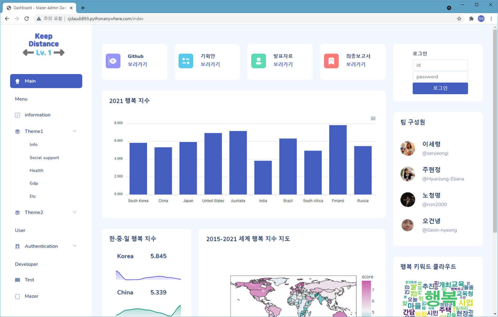

## Machine Learning 머린이

* 개인 포트폴리오 사이트 : 바로가기[https://rcm2000.github.io/]
* 경희대학교 기계공학과 졸업
* Python / SQL / Pandas / Numpy / Sklearn / Tableau
* 머신러닝 인공지능 엔지니어를 꿈꾸는 머린이입니다😊.

🙌잘부탁드립니다🙌

<게임 데이터 분석가를 목표로 공부하고 있습니다!!!>

## 진행 프로젝트
### 1.코로나 시대와 함께하는 국민의 음식, 배달 문화 분석

- 개요 : 코로나 확진자 추이와 음식 배달 주문 데이터를 분석하여 요식업 (예비)창업자에게 도움이 될 수 있는 창업위치선정, 업종선정, 식재료 원가절감, 수익 극대화 방안에 관한 인사이트를 도출합니다.

바로가기[https://github.com/rcm2000/BigdataProject02]

### 2.Kaggle Happiness report 분석(‘무엇이 행복에 가장 큰 영향을 미치는가’에 대한 분석)

- 개요 및 배경 : 우리의 프로젝트는 삶의 만족도에 대한 평가는 단순히 돈과 관련이 있을까라는 의문에서 시작됐다. 우리의 의문을 해결해줄 행복리포트가 있다는 사실을 발견하고 캐글에 있는 행복리포트 데이터를 활용해 행복에 영향을 미치는 요인들에 대해 분석했다. 행복리포트의 발간 배경은 빈곤이 끝나고 기본적인 경제적 필요가 더 사회 변화의 주요 동인이 아닐 때, 인류를 행복으로 인도할 것은 무엇인지에 대한 의문과 개선을 위함이다.

바로가기[https://github.com/rcm2000/BigdataService_team1]
